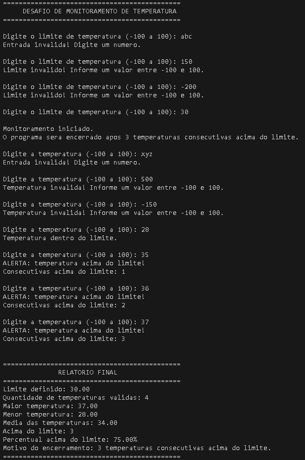
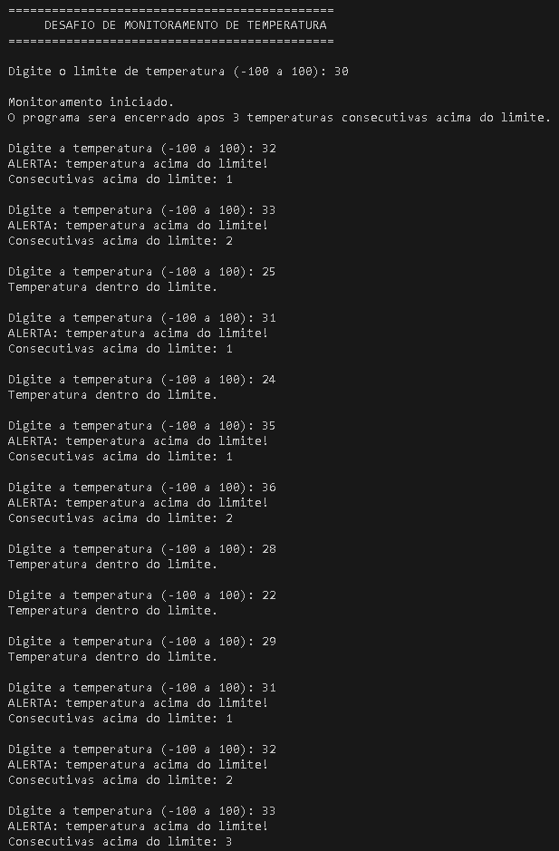
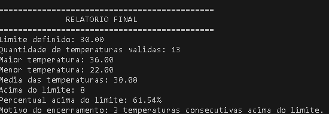
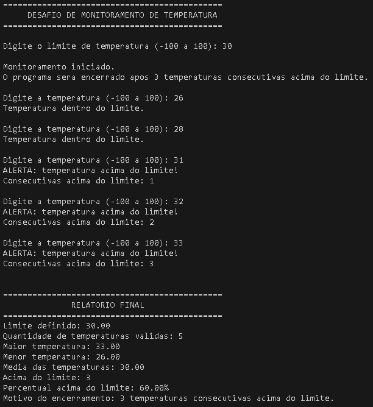

# Desafio de Monitoramento de Temperatura

## 1. Identificação

- **Aluno:** Arthur Ribeiro Ferreira
- **Curso:** Engenharia de Software — 2º Semestre
- **Disciplina:** Desenvolvimento de Algoritmo e Pensamento Computacional
- **Professora:** Profa. Karla Sartin
- **Título:** Desafio de Monitoramento de Temperatura

## 2. Objetivo

O objetivo do projeto é desenvolver um programa em linguagem C capaz de monitorar várias leituras de temperatura, compará-las com um limite definido pelo usuário e gerar um relatório final com os principais resultados.

O monitoramento é encerrado automaticamente quando são registradas **três temperaturas consecutivas acima do limite definido**.

## 3. Funcionamento do programa

### Definição do limite

Primeiro, o usuário informa o limite de temperatura. O programa valida a entrada e aceita valores entre **-100 °C e 100 °C**.

Se o usuário digitar um valor fora dessa faixa ou um valor que não seja numérico, o programa informa o erro e solicita uma nova entrada.

### Realização das leituras

Depois de definir o limite, o programa solicita temperaturas continuamente.

Cada temperatura válida é adicionada ao cálculo da:

- quantidade de leituras;
- soma das temperaturas;
- maior temperatura;
- menor temperatura;
- quantidade de temperaturas acima do limite.

### Tratamento de valores inválidos

Valores não numéricos são rejeitados.

Temperaturas menores que -100 °C ou maiores que 100 °C também são consideradas inválidas e não entram no relatório.

Quando uma entrada é inválida, o programa solicita outra leitura sem alterar os resultados anteriores. Isso inclui o contador de temperaturas consecutivas, que não aumenta nem é reiniciado por uma entrada inválida.

### Identificação de temperaturas acima do limite

Quando uma temperatura válida é maior que o limite informado pelo usuário, o programa apresenta um alerta e incrementa a quantidade de temperaturas acima do limite.

### Contagem de temperaturas consecutivas

O programa possui uma variável chamada `consecutivas`.

- Se a temperatura estiver acima do limite, o contador aumenta em 1.
- Se a temperatura estiver dentro ou igual ao limite, o contador volta para 0.
- Quando `consecutivas` chega a 3, o monitoramento é encerrado.

Assim, temperaturas acima do limite que não forem consecutivas não encerram o programa.

### Condição de encerramento

O monitoramento termina quando ocorre a sequência:

**acima do limite → acima do limite → acima do limite**

ou seja, três temperaturas consecutivas acima do limite.

Ao final, o programa apresenta um relatório com:

- limite definido;
- quantidade de temperaturas válidas;
- maior temperatura;
- menor temperatura;
- média;
- quantidade acima do limite;
- percentual acima do limite;
- motivo do encerramento.

## 4. Estruturas de repetição utilizadas

### `do...while`

Foi utilizado `do...while` para validar o limite de temperatura.

Essa estrutura foi escolhida porque o programa precisa solicitar o limite pelo menos uma vez antes de verificar se ele é válido. Caso o valor seja inválido, a pergunta é repetida.

### `while`

Foi utilizado `while` para realizar o monitoramento.

O laço continua enquanto o contador de temperaturas consecutivas acima do limite for menor que 3:

```c
while (consecutivas < 3)
```

Essa escolha é adequada porque a condição de parada precisa ser verificada antes de iniciar cada nova leitura.

### `while` para limpar o teclado

Também foi utilizado um `while` auxiliar, dentro do tratamento de entrada não numérica:

```c
while (getchar() != '\n')
```

Ele descarta os caracteres que sobraram no teclado depois de uma entrada inválida (por exemplo, `abc`), para que a próxima leitura não fique presa no mesmo texto.

## 5. Como executar

### Linux, macOS ou Git Bash

Abra o terminal na pasta do projeto e execute:

```bash
gcc monitoramento.c -o monitoramento
./monitoramento
```

### Windows (PowerShell)

Com o GCC instalado, execute:

```powershell
gcc monitoramento.c -o monitoramento
.\monitoramento.exe
```

## 6. Testes realizados

As capturas abaixo são da execução do programa no terminal.

### Teste 1 — Validação de entradas inválidas

**Objetivo:** verificar se o programa rejeita limite e temperaturas inválidos.

**Entradas utilizadas:**

```text
Limite: abc
Limite: 150
Limite: -200
Limite: 30

Temperatura: xyz
Temperatura: 500
Temperatura: -150
Temperatura: 28
Temperatura: 35
Temperatura: 36
Temperatura: 37
```

**Resultado obtido:**

- O limite `abc` foi rejeitado com a mensagem "Entrada invalida! Digite um numero."
- Os limites `150` e `-200` foram rejeitados por estarem fora da faixa de -100 a 100, e o limite `30` foi aceito.
- A temperatura `xyz` foi rejeitada como entrada não numérica, e `500` e `-150` foram rejeitadas por estarem fora da faixa. Nenhuma delas entrou nos cálculos.
- As temperaturas `28`, `35`, `36` e `37` foram processadas normalmente. Como `35`, `36` e `37` são três temperaturas consecutivas acima de `30`, o programa encerrou automaticamente.
- Relatório final: 4 temperaturas válidas, maior 37,00, menor 28,00, média 34,00, 3 acima do limite (75,00%).



### Teste 2 — Temperaturas acima do limite, porém não consecutivas

**Objetivo:** verificar se o contador é reiniciado quando uma temperatura não ultrapassa o limite.

**Entradas utilizadas:**

```text
Limite: 30

Temperatura: 32
Temperatura: 33
Temperatura: 25
Temperatura: 31
Temperatura: 24
Temperatura: 35
Temperatura: 36
Temperatura: 28
Temperatura: 22
Temperatura: 29
Temperatura: 31
Temperatura: 32
Temperatura: 33
```

**Resultado obtido:**

- O contador chegou a `2` com `32` e `33`, mas voltou para `0` quando veio `25` (dentro do limite). O programa não encerrou.
- `31` levou o contador a `1`, e `24` o reiniciou.
- `35` e `36` levaram o contador a `2`, e `28` o reiniciou. `22` e `29` mantiveram o contador em `0`.
- Somente no final, com `31`, `32` e `33`, o contador chegou a `3` e o programa encerrou automaticamente.
- Relatório final: 13 temperaturas válidas, maior 36,00, menor 22,00, média 30,08, 8 acima do limite (61,54%).

Como a execução é longa, ela foi registrada em duas capturas: a primeira mostra as leituras e a segunda mostra o relatório final.





### Teste 3 — Três temperaturas consecutivas acima do limite

**Objetivo:** verificar o encerramento automático.

**Entradas utilizadas:**

```text
Limite: 30

Temperatura: 26
Temperatura: 28
Temperatura: 31
Temperatura: 32
Temperatura: 33
```

**Resultado obtido:**

- `26` e `28` estão dentro do limite e mantiveram o contador em `0`.
- `31` aumentou o contador para `1`, `32` para `2` e `33` para `3`.
- Ao chegar a 3, o programa encerrou automaticamente e apresentou o relatório final.
- Relatório final: 5 temperaturas válidas, maior 33,00, menor 26,00, média 30,00, 3 acima do limite (60,00%).



## 7. Organização do projeto

```text
desafio-monitoramento/
│
├── monitoramento.c
│
├── README.md
│
└── evidencias/
    ├── teste01.png
    ├── teste02.png
    ├── teste02b.png
    └── teste03.png
```

## 8. Reflexão final

**Por que você escolheu while, do...while ou uma combinação das duas estruturas? Em qual parte do algoritmo a diferença entre testar a condição antes ou depois da execução foi importante para sua solução?**

Escolhi utilizar uma combinação de `do...while` e `while` porque cada estrutura se encaixa melhor em uma parte do algoritmo.

Usei `do...while` na definição do limite porque o usuário precisa informar um valor pelo menos uma vez. Depois da primeira tentativa, o programa verifica se o valor é válido e, caso seja inválido, solicita novamente.

Usei `while` no monitoramento porque a condição de encerramento precisa ser verificada antes de realizar uma nova leitura. Enquanto não houver três temperaturas consecutivas acima do limite, o programa continua solicitando temperaturas.

A diferença entre testar a condição antes ou depois da execução foi importante principalmente na validação do limite e no controle do monitoramento. No `do...while`, a leitura acontece antes da verificação, o que evita ter que criar um valor inicial artificial para o limite. No `while`, a condição é verificada antes de cada nova leitura: assim que a terceira temperatura consecutiva acima do limite é registrada, `consecutivas < 3` deixa de ser verdadeira e o programa vai direto para o relatório final, sem pedir outra temperatura.
